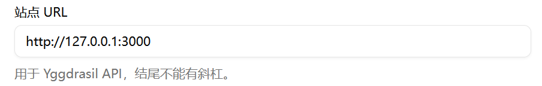
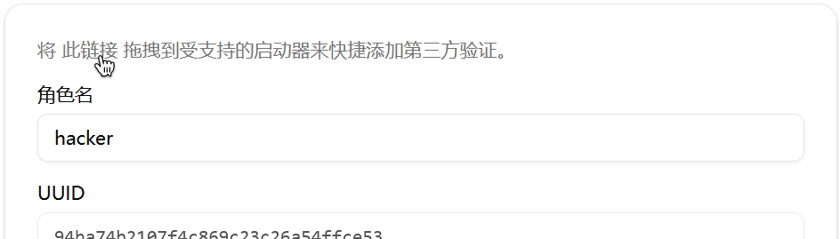

```
  __  __  _____ _      _ _
 |  \/  |/ ____| |    (_) |
 | \  / | (___ | |     _| |__  _ __ __ _ _ __ _   _
 | |\/| |\___ \| |    | | '_ \| '__/ _` | '__| | | |
 | |  | |____) | |____| | |_) | | | (_| | |  | |_| |
 |_|  |_|_____/|______|_|_.__/|_|  \__,_|_|   \__, |
                                               __/ |
                                              |___/
```

# Minecraft Skin Library

一个可私有部署的 Web 应用，用于收集、整理和预览 Minecraft 皮肤与披风，并通过 [Yggdrasil](https://minecraft.wiki/w/Yggdrasil) 实现第三方登录。

[English](README.md) | 简体中文

## 功能

- **3D 预览** — 基于 Three.js 的交互式皮肤和披风查看器，支持行走动画
- **皮肤与披风管理** — 上传、分类、打标签，并记录来源
- **搜索与筛选** — 按名称、分类和标签筛选，并按时间排序
- **Docker 部署** — 单镜像部署，基于 volume 的数据持久化

## 快速开始

### Docker Compose
1. `docker-compose.yml`
```
services:
  ms-library:
    image: ghcr.io/smallzombie/ms-library:latest
    ports:
      - "3000:3000"
    volumes:
      - <your_data_dir>:/app/data
    restart: unless-stopped
```
2. `docker compose up -d`
3. 访问 `http://localhost:3000`，第一个注册的账户会自动成为管理员。

### 开发

1. `npm install`
2. `npm run dev` or `npm run dev:http`
3. 访问 `http://localhost:3000`，第一个注册的账户会自动成为管理员。

## 接下来

### 第三方登录

想要实现第三方登录（类似 LittleSkin），你只需要：
1. 在站点配置中填写站点 URL


2. 创建一个游戏角色

3. 拖动角色页面中的链接，或手动将 URL 填入支持的启动器


4. 使用你的账户名（或角色名）和密码登录

5. Enjoy.
